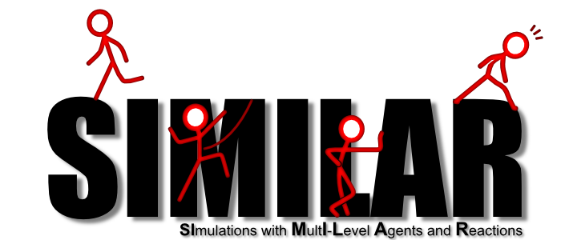

The [SIMILAR](http://www.lgi2a.univ-artois.fr/~morvan/similar.html) suite is a Java API under the [CeCILL-B license](http://cecill.info) whose purpose is to support the implementation of multi-agent-based simulations using the formerly named IRM4MLS meta-model. 
This software defines an API to implement such simulations and provides usage examples.

A binary distribution of SIMILAR can be downloaded at [this address](http://www.lgi2a.univ-artois.fr/~morvan/similar.html).

## Usage

For more information about SIMILAR and how to use it, see [its documentation](http://www.lgi2a.univ-artois.fr/~morvan/similar/docs/README.html) and the files [README_USER.txt](https://forge.univ-artois.fr/yoann.kubera/similar/blob/master/README_USER.txt) and [README_DEVELOPPER.txt](https://forge.univ-artois.fr/yoann.kubera/similar/blob/master/README_DEVELOPPER.txt).

## License

SIMILAR is distributed under the [CeCILL-B license](http://cecill.info). In a few words, "if the initial program is under CeCILL-B, you can distribute your program under any license that you want (without the need to distribute the source code) provided you properly mention the use that you did of the initial program" (from the [CeCILL-B FAQ](http://www.cecill.info/faq.en.html#differences) ).

See the file  [LICENSE.txt](LICENSE.txt) for more information. 

## Contributors

Yoann KUBERA - [mail](mailto:yoann.kubera@gmail.com) - [homepage](http://yoannkubera.net/) - designer, architect, developer.

Gildas MORVAN - [mail](mailto:gildas.morvan@univ-artois.fr) - [homepage](http://www.lgi2a.univ-artois.fr/~morvan/) - creator of the IRM4MLS meta-model, developer.
